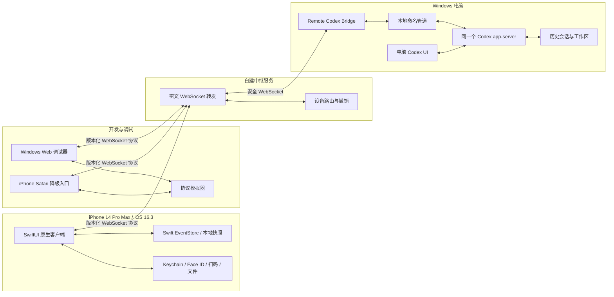

# Codex Remote 实施计划

## 1. 文档信息

| 项目 | 内容 |
| --- | --- |
| 项目名称 | Codex Remote |
| 文档类型 | 架构与实施计划 |
| 目标手机 | iPhone 14 Pro Max |
| 手机系统 | iOS 16.3 |
| 手机安装方式 | GitHub Actions 编译 IPA，TrollStore 安装 |
| 开发路线 | 协议与 Bridge 先行；最终手机 UI 使用原生 SwiftUI，Web 保留为桌面调试器、协议回归台和降级入口 |
| 目标电脑 | Windows Codex Desktop 所在电脑 |
| 当前 Codex Desktop 基线 | 26.727.6591.0 |
| 核心目标 | 在手机上以接近桌面 Codex 的交互方式，远程操作电脑上的同一套 Codex 会话与运行环境 |

## 2. 项目目标

Codex Remote 不是远程桌面，也不是在手机上独立运行一个新的 Codex。它是电脑 Codex 的原生远程客户端：

- 所有模型请求、工具调用、命令执行、文件访问和代码修改都发生在电脑上。
- 手机显示电脑端 Codex 的历史会话、消息、推理摘要、计划、工具调用、命令输出、文件差异和审批请求。
- 手机可以打开历史会话继续发送消息，也可以选择电脑上的工作区创建新会话。
- 手机与电脑必须看到同一个线程、同一个回合以及同一份实时状态。
- 手机端尽量复现桌面 Codex 的信息结构和交互逻辑，包括运行中展开、完成后自动折叠、停止任务、批准操作和断线恢复。
- 已完成的响应式 Web 应用继续承担桌面调试、协议模拟、回归测试和应急访问；正式 iPhone 客户端使用原生 SwiftUI 重写界面、状态存储和生命周期管理。Web 与 iOS 不共享 UI 代码，但必须共享同一份版本化线协议、脱敏夹具和行为验收矩阵。
- 手机不保存模型 API 密钥，也不直接访问用户的自定义模型服务。
- 项目不依赖 OpenAI 官方私有远程控制接口，不受其地区、账号和手机版本门控影响。

## 3. 非目标

第一阶段明确不做以下内容：

- 不实现 Windows 远程桌面、屏幕视频流或鼠标键盘控制。
- 不复刻或调用 `chatgpt.com/backend-api/wham/remote/control` 私有协议。
- 不尝试展示模型未公开的原始思维链，只展示 Codex 桌面端同等级别的推理摘要和状态事件。
- 不把 SQLite 数据库作为实时控制接口，也不直接修改历史数据库。
- 不在手机端存放模型提供商密钥、ChatGPT 令牌或 Windows 凭据。
- 不在第一版承诺 iOS 后台长期保持 WebSocket。
- 不在第一版要求 Apple Developer 账号或 APNs 推送权限。

## 4. 总体架构



架构核心是“同一个 app-server”。手机不能通过另一个完全独立的 Codex 进程模拟历史会话，否则无法保证正在运行的回合、审批和实时事件与桌面一致。

开发过程采用“协议共用、界面分离”：Web 端继续快速验证协议、Bridge、故障夹具和桌面行为；SwiftUI 端独立实现正式手机交互，并通过同一组 JSON 夹具、请求语义和端到端用例验证一致性。日常协议开发不依赖反复打包 IPA，原生 UI 改动则由 Xcode 模拟器、XCTest、XCUITest 和 GitHub macOS Runner 验证。

## 5. 核心设计原则

### 5.1 单一事实来源

- 线程、回合和工具状态以电脑上的 Codex app-server 为事实来源。
- Windows Bridge 只负责协议转换、安全连接和事件缓存。
- iPhone 只缓存用于渲染的数据，不独立决定任务状态。
- 中继服务器只转发加密帧，不解析 Codex 内容。

### 5.2 不直接操作历史数据库

- 历史会话通过 app-server 的线程接口读取。
- 新建、继续、停止和审批均通过 app-server 执行。
- 不直接写入 `state_5.sqlite`、`logs_2.sqlite` 或会话 JSONL。
- 数据库只允许在诊断阶段进行只读检查。

### 5.3 版本失败关闭

- Codex Desktop 和 native app-server 必须使用精确版本映射。
- 未识别的新版本不得自动套用旧补丁。
- Store 更新后先停止远程桥接并提示重新适配。
- 所有 native 产物记录源码提交、补丁哈希和二进制哈希。

### 5.4 最小权限

- Bridge 以普通用户权限运行。
- 手机只能选择电脑明确暴露的工作区。
- API 密钥、主模型配置和文件权限保留在电脑。
- 高风险操作必须显示完整内容并获得明确批准。

### 5.5 协议共用与原生 UI

- SwiftUI 是正式 iPhone 客户端的唯一生产 UI，不在 IPA 中嵌入 Web 页面或 WKWebView 业务界面。
- React Web UI 保留为 Windows 桌面调试器、协议模拟器前端、自动化回归台和紧急降级入口。
- TypeScript 与 Swift 不共享视图或运行时状态代码；二者共享版本化 JSON Schema、请求方法、事件语义、错误码和脱敏夹具。
- Swift 端使用 `Codable` 模型、单向事件归约器和 `ObservableObject` Store；协议生成结果必须在 CI 中校验无漂移。
- 原生客户端直接使用 Keychain、LocalAuthentication、系统文件选择、照片选择、二维码扫描和 App 生命周期 API。
- 生产设备私钥只保存在 Keychain；Web 调试版使用独立开发令牌，不能复用生产设备身份。
- Web 与 SwiftUI 对同一协议夹具必须得到相同的线程、回合、审批和连接状态，视觉实现允许不同。

## 6. 功能范围

### 6.1 第一优先级功能

#### 历史会话

- 读取电脑端全部可见历史会话。
- 按工作区或项目分组。
- 分页加载和下拉刷新。
- 支持标题与路径搜索。
- 显示标题、工作区、最后更新时间和运行状态。
- 打开历史会话并加载完整消息。
- 在原线程中继续发送消息。
- 保持原线程的工作目录、模型提供商和会话标识。

#### 新建会话

- 从电脑提供的工作区白名单中选择目录。
- 使用电脑当前模型、提供商、沙箱和权限设置。
- 新会话立即出现在手机和电脑历史列表。
- 手机不能直接提交任意系统路径。

#### 实时消息与事件

- 用户消息。
- 助手文本流。
- 推理摘要流。
- 计划与步骤更新。
- 工具调用生命周期。
- 命令标准输出和错误输出。
- 文件创建、编辑和差异。
- 审批请求与审批结果。
- 回合完成、失败和中断。

#### 操作控制

- 发送消息。
- 停止当前任务。
- 批准或拒绝操作。
- 重试失败回合。
- 继续中断会话。
- 电脑与手机双向实时同步。

#### 断线恢复

- 每个事件带有单调递增序号和唯一 ID。
- 手机保存最后确认序号。
- 重连后从该序号继续同步。
- 客户端按事件 ID 幂等去重。
- 缓存过期时重新获取线程快照。
- 电脑离线时明确显示离线，不把消息伪装成已发送。

### 6.2 第二优先级功能

- 会话归档、重命名和删除。
- 图片与文件附件。
- 生成文件预览和下载。
- 语音输入。
- 多台手机连接。
- 局域网直连模式。
- 主题、字体和显示密度设置。
- 完成通知。
- 无界面 app-server 常驻模式。

## 7. Codex app-server 接入方案

### 7.1 最终方案：同实例多客户端

最终版本需要为当前 Codex native app-server 增加自建远程传输入口：

- 保留桌面端现有 IPC 或标准输入输出连接。
- 增加仅限本机访问的命名管道。
- Windows Bridge 通过命名管道成为第二个客户端。
- app-server 将线程、回合和工具事件广播给桌面端与 Bridge。
- 手机请求通过 Bridge 进入同一个线程管理器。
- 不改变桌面端原有交互和主模型路由。

该方案必须满足：

1. 手机发送消息后，桌面立即出现同一条消息。
2. 桌面发送消息后，手机立即显示。
3. 两端同时观察到同一回合的流式输出。
4. 审批只属于同一回合，不会被另一个进程截获。
5. 新建会话立即出现在桌面侧栏。

### 7.2 临时开发方案：第二 app-server

开发协议和 UI 时，可以暂时启动第二个 app-server，但不能作为最终交付方案。

已知限制：

- 桌面可能无法实时显示手机发起的回合。
- 同一线程可能被两个进程同时操作。
- 审批事件可能无法正确路由。
- 活跃回合需要刷新后才能在另一端出现。

### 7.3 版本适配流程

当前基线为 Codex Desktop `26.727.6591.0`，正式开发前必须完成：

1. 只读确认随包 `codex.exe` 的准确版本。
2. 找到完全匹配的 Codex Rust 源码标签或提交。
3. 记录原始 native 二进制哈希。
4. 更新外置 Native Host 的精确版本、源码标签和原生哈希门禁。
5. 使用本机 .NET 8 SDK 编译自包含 Windows x64 单文件 EXE。
6. 验证版本、源码标签、原生哈希和 Native Host 产物校验和。
7. 运行 Desktop stdio、Bridge WebSocket 和同线程恢复集成测试。
8. GitHub Windows Runner 仅作为可选 CI 重复构建，不作为本机联调前置条件。
9. 对未知版本失败关闭，不修改或重打包 MSIX。

版本清单示例：

```json
{
  "desktopVersion": "26.727.6591.0",
  "codexSourceCommit": "待确认",
  "protocolVersion": 1,
  "patchSha256": "待生成",
  "binarySha256": "待生成"
}
```

## 8. Windows Bridge

### 8.1 技术选型

- 语言：Rust。
- 运行平台：Windows x64。
- 异步运行时：Tokio。
- 本地传输：Windows 命名管道。
- 远程传输：加密 WebSocket。
- 存储：加密 JSON 或 SQLite。
- 密钥保护：Windows DPAPI。

### 8.2 职责

- 连接本机 Codex app-server。
- 与中继服务保持出站 WebSocket。
- 将 Codex 内部事件转换为稳定的手机协议。
- 维护事件序号、确认和断线重放缓冲。
- 管理配对设备和撤销列表。
- 生成一次性二维码。
- 检查 Codex 版本兼容性。
- 提供托盘状态与诊断日志。
- 不保存模型 API 密钥。

### 8.3 本地文件布局

```text
%LOCALAPPDATA%\RemoteCodex\
├── config.json
├── device-identity.bin
├── paired-devices.json
├── event-cache\
└── logs\
```

### 8.4 启动策略

第一版：

- Codex Desktop 必须保持运行。
- Bridge 开机启动。
- Bridge 自动检测并连接 Codex app-server。
- Codex 关闭后，手机显示电脑离线。

后续版本：

- Bridge 可按需启动无界面的 app-server。
- 桌面重新打开时处理实例接管和状态合并。

## 9. 远程协议

### 9.1 消息信封

```json
{
  "version": 1,
  "requestId": "uuid",
  "threadId": "uuid",
  "sequence": 1234,
  "type": "turn.item.delta",
  "payload": {}
}
```

### 9.2 请求类型

- `connection.status`
- `workspace.list`
- `thread.list`
- `thread.get`
- `thread.create`
- `thread.send`
- `thread.interrupt`
- `thread.retry`
- `thread.archive`
- `approval.resolve`
- `events.resume`
- `device.revoke`

### 9.3 事件类型

- `thread.created`
- `thread.updated`
- `turn.started`
- `message.user`
- `message.assistant.delta`
- `reasoning.started`
- `reasoning.summary.delta`
- `reasoning.completed`
- `plan.updated`
- `tool.started`
- `tool.output.delta`
- `tool.completed`
- `file.diff`
- `approval.requested`
- `approval.resolved`
- `turn.completed`
- `turn.failed`
- `turn.interrupted`

### 9.4 状态同步

首次打开线程：

1. 手机请求线程快照。
2. Bridge 返回消息、当前回合和最新事件序号。
3. 手机写入本地加密缓存。
4. 从下一事件序号开始接收实时事件。

断线恢复：

1. 手机提交最后确认序号。
2. Bridge 重放缺失事件。
3. 缓存缺失时重新发送线程快照。
4. 手机按事件 ID 去重。

### 9.5 并发控制

- 每个线程同一时间只允许一个正在提交的用户回合。
- 请求包含幂等 ID，重连重发不能生成重复回合。
- 桌面与手机同时提交时，由 app-server 返回明确冲突状态。
- 审批请求绑定线程 ID、回合 ID 和工具调用 ID。

## 10. Web 调试器与原生 iPhone 客户端

### 10.1 设备基线

| 项目 | 配置 |
| --- | --- |
| 设备 | iPhone 14 Pro Max |
| 芯片 | A16，arm64 |
| 系统 | iOS 16.3 |
| 最低部署版本 | iOS 16.3 |
| iOS UI 基础 | SwiftUI、Swift、Combine |
| iOS 网络 | `URLSessionWebSocketTask` |
| iOS 状态 | `Codable` 协议模型、`ObservableObject` EventStore、事件归约器 |
| Web 调试器 | React、TypeScript、Vite |
| 原生能力 | Keychain、LocalAuthentication、PhotosUI、文件选择、二维码和生命周期 |
| 安装 | TrollStore IPA |
| 目标方向 | 竖屏优先，兼容横屏 |

需要适配灵动岛、安全区域、键盘高度和 430×932 pt 逻辑画布。

### 10.2 技术选型

- SwiftUI 实现正式 iPhone 页面；除系统兼容需要外，不以 UIKit 承担业务界面。
- `URLSessionWebSocketTask` 负责连接、心跳、重连、事件回放和请求响应关联。
- `Codable` 模型由版本化协议 Schema 生成或校验，禁止手工维护一套与 TypeScript 不一致的 Swift 字段。
- `ObservableObject` EventStore 负责线程状态、事件去重、快照恢复、未读计数和连接状态；视图只订阅派生状态。
- Markdown 和代码块使用原生文本布局与自定义代码视图；差异使用惰性行模型，不把整份大文本一次性放入单个 `Text`。
- 时间线使用 `ScrollView` 与 `LazyVStack`，超过阈值后启用回合窗口化；解析 Markdown、差异和大输出在后台任务完成并缓存。
- 图片、音频和文本附件使用 `PhotosUI`、文件导入器和受限上下文片段；单文件、总大小和 MIME 类型继续复用协议限制。
- Keychain、LocalAuthentication、系统二维码扫描、剪贴板和 App 生命周期全部使用原生 API。
- React/Vite Web 继续用于 Windows 调试器、协议模拟器和 Playwright 回归，不进入 iOS IPA。

### 10.3 双端开发流程

1. 固化协议 Schema、请求/事件方法、错误码和脱敏夹具，先保证 TypeScript 与 Swift 可互操作。
2. 保持 Windows Web 调试器可运行，用于快速验证 Bridge 和事件序列，不再把它当作手机最终 UI。
3. 建立 `apps/ios/RemoteCodex.xcodeproj`，先实现 WebSocket 客户端、请求关联和 `EventStore`。
4. 使用协议模拟器夹具实现会话列表、时间线、输入、停止、审批、重试和断线恢复。
5. 实现原生 Markdown、代码块、差异、附件、工作区选择、未读和回到底部。
6. 接入真实 Bridge、Cloudflare HTTPS/WSS、Keychain 配对、Face ID 和前后台生命周期。
7. 在 macOS Runner 上执行 Swift 单元/UI/性能测试和无签名模拟器构建；只在候选版本阶段生成 IPA。
8. 使用 TrollStore 在 iPhone 14 Pro Max / iOS 16.3 真机完成安装、长会话、弱网、后台和并发操作验收。

原生迁移验收条件：

- Swift 与 Web 对同一协议夹具产生一致的线程、回合、审批和连接状态。
- 原生端不依赖 WKWebView、JavaScript 注入或浏览器 LocalStorage 保存生产设备身份。
- 长历史、流式输出和差异视图达到第 10.7 节性能预算。
- Web 调试器仍可独立连接模拟器和 Bridge，作为原生端故障隔离工具。

### 10.4 页面结构

#### 启动与设备页

- Face ID 解锁。
- 显示已配对电脑。
- 显示在线、离线和连接中状态。
- 扫描 Bridge 生成的二维码。
- 支持撤销和重新配对。

#### 会话侧栏

- 滑出式侧栏。
- 新建会话按钮。
- 搜索框。
- 按项目分组的历史会话。
- 运行中、未读和等待审批指示。
- 下拉刷新和分页加载。

#### 会话页面

- 顶部显示标题、工作区和连接状态。
- 中间显示消息与事件时间线。
- 底部提供多行输入框、附件、发送和停止按钮。
- 用户查看旧消息时不强制跳回底部。
- 新事件到达时显示“回到底部”和未读数量。

#### 思考卡片

```text
等待开始     -> 收起
正在思考     -> 自动展开
工具执行中   -> 保持展开
等待审批     -> 保持展开
回合完成     -> 自动折叠
用户手动展开 -> 本回合保持展开
```

- 仅展示 Codex 实际提供的推理摘要和状态。
- 历史回合默认折叠。
- 当前未完成回合默认展开。
- 收到可靠的完成、失败或中断事件后才折叠。

#### 工具调用卡片

- 工具名称与状态。
- 命令、退出码和持续时间。
- 流式标准输出与错误输出。
- 展开、折叠和复制。
- 超长输出按块加载。
- 高风险操作显示明确审批按钮。

#### 文件差异

- 文件路径。
- 新增和删除行数。
- 分块差异和行号。
- 语法高亮。
- 单文件折叠。
- 大文件按块加载。

### 10.5 原生模块边界

SwiftUI 客户端直接实现：

- 会话导航、工作区选择、消息和事件时间线。
- Markdown、代码、差异、工具卡片和大输出窗口化。
- 输入、附件、停止、审批、重试、未读和回到底部。
- 协议状态机、事件去重、请求幂等、断线恢复和本地快照。
- Keychain 设备私钥、Face ID、二维码、文件、照片、剪贴板和生命周期。
- TrollStore 安装环境下的版本、完整性信息和安全退出。

Web 调试器继续实现相同的业务行为，但只承担：

- 协议和 Bridge 快速联调。
- 故障夹具、浏览器端回归和可视化诊断。
- 原生客户端不可用时的临时降级访问。
- 不持有生产 iOS 设备私钥，不作为 IPA 的嵌入资源。

### 10.6 iOS 后台限制

iOS 16.3 不允许普通 App 无限保持后台 WebSocket，因此：

- 进入后台后安全断开。
- 回到前台后通过事件序号恢复。
- 不依赖 TrollStore 绕过系统后台限制。
- 第一版不把 APNs 作为硬性要求。
- 没有 Apple Developer 账号时不承诺系统级完成通知。

### 10.7 原生性能预算

以 iPhone 14 Pro Max / iOS 16.3 真机为最终基准，模拟器只做趋势检查：

- 已有本地快照时，冷启动到可交互会话画面不超过 1.5 秒；网络最新状态允许随后异步补齐。
- 500 个回合或 10,000 个时间线条目的夹具下，滚动期间不出现可感知的持续卡顿，主线程单次阻塞不得超过 100 ms。
- 长历史压力场景的常驻内存目标不超过 250 MB；离开线程后可释放的 Markdown、差异和附件缓存必须回收。
- 流式增量按帧或 30～50 ms 批量合并，禁止每个 token 都触发整条时间线重新布局。
- Markdown、语法标记、差异解析和大输出分块在主线程外执行，结果按内容哈希缓存。
- 用户停留在旧消息时不得因新事件改变当前阅读位置；点击“回到底部”后 300 ms 内完成定位。
- 通过 XCTest 性能用例、Xcode Instruments 的 Time Profiler、Hangs 和 Allocations 记录候选版本基线。

## 11. 中继服务

### 11.1 技术选型

- Rust。
- Axum。
- Tokio。
- WebSocket。
- Docker 部署。
- Caddy 或 Nginx 提供 TLS。

### 11.2 中继职责

- 接受电脑和手机的出站连接。
- 根据设备 ID 转发密文帧。
- 维护在线状态。
- 执行限流和连接保护。
- 同步设备撤销状态。

### 11.3 明确禁止

- 不解析对话内容。
- 不保存 Codex 历史。
- 不保存模型 API 密钥。
- 不执行任何电脑任务。
- 不持有能够解密业务数据的长期密钥。

## 12. 配对与端到端加密

### 12.1 密码学方案

- 设备身份签名：Ed25519。
- 密钥协商：X25519。
- 消息加密：ChaCha20-Poly1305。
- 每次连接使用临时会话密钥。
- 每个数据帧包含序号并防止重放。

### 12.2 配对流程

1. Bridge 生成一次性配对令牌和电脑临时公钥。
2. Bridge 显示包含中继地址、电脑设备 ID、公钥和令牌的二维码。
3. iPhone 扫码并生成自己的设备密钥。
4. 双方通过一次性令牌确认密钥交换。
5. 电脑显示手机名称并要求最终确认。
6. 配对令牌立即失效。
7. 后续连接只接受已登记设备。

### 12.3 设备撤销

- 电脑托盘菜单列出全部手机。
- 每台设备单独撤销。
- 撤销信息同步到中继。
- 被撤销设备的旧令牌和会话密钥全部失效。

## 13. 仓库结构

```text
codex-remote/
├── apps/
│   ├── web/
│   │   ├── src/
│   │   ├── public/
│   │   └── e2e/
│   ├── ios/
│   │   ├── RemoteCodex/
│   │   │   ├── App/
│   │   │   ├── Core/
│   │   │   ├── Features/
│   │   │   ├── DesignSystem/
│   │   │   └── Resources/
│   │   ├── RemoteCodexTests/
│   │   ├── RemoteCodexUITests/
│   │   └── RemoteCodex.xcodeproj
│   └── windows-bridge/
├── packages/
│   ├── ui/
│   ├── client-protocol/
│   ├── client-state/
│   ├── event-renderer/
│   ├── protocol-mock/
│   └── protocol-schema/
├── crates/
│   ├── remote-protocol/
│   ├── relay-server/
│   ├── crypto/
│   ├── codex-adapter/
│   └── event-normalizer/
├── codex-patches/
│   └── 26.727.6591.0/
├── deploy/
│   ├── docker-compose.yml
│   ├── Caddyfile.example
│   └── relay.env.example
├── scripts/
│   ├── verify-codex-version.ps1
│   ├── generate-protocol-fixtures.ps1
│   ├── package-web-assets.ps1
│   ├── package-ios.sh
│   └── package-msix.ps1
├── docs/
│   ├── architecture.md
│   ├── protocol.md
│   ├── security.md
│   ├── pairing.md
│   └── release.md
└── .github/
    └── workflows/
        ├── web-check.yml
        ├── ios-build.yml
        ├── windows-build.yml
        ├── relay-build.yml
        ├── codex-native-build.yml
        └── release.yml
```

## 14. 本机构建与 GitHub Actions

建议使用私有 GitHub 仓库。Windows Web、Bridge、协议模拟器和 Native Host 可在本机完成编译、测试与联调；SwiftUI 客户端的编译、XCTest、XCUITest、性能基线和 IPA 打包必须在 macOS/Xcode 环境执行，当前 Windows 开发机通过 GitHub macOS Runner 获得可重复验证结果。

### 14.1 Web 工作流

触发方式：每次 Pull Request 和主分支提交。

流程：

1. 使用固定 Node.js 主版本和依赖锁文件。
2. 安装前端依赖。
3. 执行 TypeScript 类型检查。
4. 执行代码规范检查。
5. 运行状态机和组件单元测试。
6. 使用协议模拟器运行浏览器集成测试。
7. 使用 Playwright Chromium 和 WebKit 执行关键流程。
8. 构建生产静态资源。
9. 检查产物大小和不安全依赖。
10. 上传 Web 预览 Artifact，供协议调试、Bridge 诊断和降级入口验证。

关键自动化场景：

- 历史会话分页和搜索。
- 新建与继续会话。
- 流式消息。
- 推理卡片完成后自动折叠。
- 工具输出和文件差异。
- 审批、停止、失败和重试。
- WebSocket 断线与事件重放。

### 14.2 iOS 原生持续集成与打包工作流

触发方式：

- 修改 `apps/ios`、协议 Schema 或共享夹具的 Pull Request：运行原生编译、单元测试、UI 冒烟测试和协议一致性检查，不生成 IPA。
- 阶段 8 候选版：生成无签名模拟器构建和测试报告 Artifact，不对外发布。
- 阶段 9 候选版：通过手动 `workflow_dispatch` 生成 TrollStore 测试 IPA Artifact。
- 最终发布标签：生成正式 IPA 并上传 GitHub Release。
- 仅文档、Web 或 Windows 代码变化时不触发 macOS 工作流；主分支普通提交不自动生成 IPA。

流程：

1. 使用 GitHub macOS Runner。
2. 输出 Runner、Xcode 和 SDK 信息。
3. 检查 Xcode 是否支持 iOS 16.3 deployment target。
4. 根据协议 Schema 生成或校验 Swift `Codable` 模型，生成结果有差异时失败。
5. 解析并锁定 Swift Package 依赖。
6. 执行 Swift 格式、静态分析和并发安全检查。
7. 编译 iOS 模拟器 Debug 版本。
8. 运行协议、EventStore、WebSocket、快照、Markdown 和差异单元测试。
9. 使用 XCUITest 运行会话、发送、停止、审批、断线恢复和附件冒烟流程。
10. 运行长历史和流式更新性能基线，上传测试与 Instruments 摘要。
11. 候选版使用真机 SDK 构建 arm64 Release，禁止标准 App Store 代码签名。
12. 使用固定 entitlements 生成 `Payload/RemoteCodex.app` 和 `RemoteCodex-ios16-arm64.ipa`。
13. 生成 SHA-256、构建清单和协议版本清单。
14. 上传 Artifact；正式标签构建时上传 GitHub Release。

GitHub Runner 不保证提供精确的 iOS 16.3 模拟器，因此：

- deployment target 固定为 iOS 16.3。
- 自动化测试使用 Runner 提供的兼容模拟器。
- 最终兼容性在 iPhone 14 Pro Max / iOS 16.3 真机验收。

### 14.3 Windows Bridge 工作流

1. 使用 GitHub Windows Runner。
2. 安装固定 Rust 工具链。
3. 使用 MSVC x64 编译。
4. 运行协议、加密和断线恢复测试。
5. 生成单文件 Bridge。
6. 生成 SHA-256 和 SBOM。
7. 上传 Artifact。

### 14.4 Native Host Windows 工作流

1. 读取目标 Desktop、Codex native、源码标签和 SHA-256 常量。
2. 安装或选择固定 .NET 8 SDK。
3. 本机默认发布自包含 Windows x64 单文件 EXE。
4. 生成并核对 Native Host SHA-256。
5. 运行 CLI 透明转发、Desktop stdio、Bridge WebSocket 和同线程恢复测试。
6. GitHub Windows runner 可执行相同步骤并上传 Artifact，但不阻塞本机安装联调。
7. 未知 Desktop 或 Codex 版本禁止安装。

### 14.5 Windows 本地安装

- 安装在 Codex Desktop 完全退出后由外部 Windows PowerShell 5 执行。
- 只写当前用户的 `CODEX_CLI_PATH` 和 `CODEX_REMOTE_REAL_CODEX_PATH`。
- 不修改 WindowsApps、ASAR、`config.toml`，也不重打包或签名 MSIX。
- 安装前核对 Native Host 和阶段 0 原生副本哈希，重复安装保留上一版 EXE，支持恢复原环境变量。

### 14.6 Relay 工作流

- 使用 Linux Runner。
- 运行 Rust 测试。
- 构建 Docker 镜像。
- 执行依赖与镜像漏洞扫描。
- 推送到 GitHub Container Registry。
- Release 标签生成固定版本镜像。

### 14.7 Actions 安全

- 第三方 Action 固定完整提交哈希，不使用浮动 `@main`。
- PR 工作流不得读取发布密钥。
- 默认权限设置为 `contents: read`。
- 仅 Release 工作流使用 `contents: write`。
- Node.js、Swift、Rust 和其他依赖均提交锁文件。
- 每个发布产物附带 SHA-256。
- Git 推送必须另行取得用户明确同意。

## 15. 实施阶段

| 阶段 | 状态 | 工作内容 | 验收条件 |
| --- | --- | --- | --- |
| 0 | 已完成 | 当前 Codex 版本与协议勘探 | 找到准确源码版本，并确认同实例多客户端可行性 |
| 1 | 已完成 | 稳定远程协议与协议模拟器 | 可确定性模拟所有消息、推理、工具、审批和异常事件 |
| 2 | 已完成 | 响应式 Web UI | 浏览器完成历史、新建、继续、流式渲染和自动折叠 |
| 3 | 已完成 | Windows Bridge 与真实 Codex | Web UI 能控制真实 Codex app-server |
| 4 | 进行中 | 同实例 Native Host、Cloudflare Tunnel 与 iPhone Safari 联调 | Desktop 与手机共享同一 app-server，并通过无需手机 VPN 的 HTTPS/WSS 完成主要流程 |
| 5 | 进行中 | Cloudflare 安全加固与可选应用层加密 | 回环源站、设备鉴权、代理边界和 HTTPS 安全响应头已完成；应用层端到端加密按隐私需求决定 |
| 6 | 已完成 | 产品完善与完整交互一致性 | 工具、差异、审批、停止、重试、加载错误和断线恢复在浏览器与 Safari 中完成 |
| 7 | 未开始 | 原生 SwiftUI 客户端基础 | Swift 协议模型、WebSocket、EventStore、Keychain 和核心页面可连接模拟器与 Bridge |
| 8 | 未开始 | 原生功能对齐、性能与 CI | 原生端完成阶段 6 功能矩阵、版本保护、弱网和性能预算，macOS CI 全绿 |
| 9 | 未开始 | TrollStore IPA 与最终真机验收 | GitHub Actions 生成 IPA，iPhone 14 Pro Max / iOS 16.3 安装并完成长期使用验收 |

## 16. 详细阶段计划

### 阶段 0：版本与协议勘探

- 读取 Codex Desktop 包版本。
- 复制 native 二进制到安全临时目录后读取版本。
- 查找匹配的 Codex 源码标签和提交。
- 检查 app-server 启动方式和桌面连接方式。
- 列出线程、回合、工具和审批事件类型。
- 验证同一 app-server 是否能支持第二客户端。
- 编写协议映射和版本兼容性报告。

停止条件：无法找到准确源码映射时，不进入 native 替换阶段。

### 阶段 1：协议与模拟客户端

- 建立平台无关的 `packages/protocol` TypeScript 包；阶段 4 的同实例接入使用外置 .NET Native Host，不修改 WindowsApps，也不提前引入 Codex Rust/MSIX 重编译。
- 建立前端和 Windows Bridge 共用的协议类型、编解码、规范化与状态包。
- 定义请求、响应、事件、错误和版本协商。
- 建立 Codex 事件规范化层。
- 编写可脚本化的协议模拟器。
- 覆盖历史列表、新建、继续、流式输出、停止、审批、失败和断线。
- 支持时间加速、暂停、乱序、重复和丢包注入。
- 保存脱敏协议样例作为回归测试夹具。

### 阶段 2：响应式 Web UI

- 建立 React、TypeScript 和 Vite 工程。
- 建立共享 UI、状态管理和事件渲染包。
- 实现会话侧栏、项目分组、搜索和分页。
- 实现消息、推理、计划、工具、终端和文件差异组件。
- 实现输入、停止、审批、失败和重试。
- 实现运行中展开、完成后折叠和手动展开保持。
- 使用协议模拟器完成全部核心 UI 调试。
- 使用 Playwright Chromium 与 WebKit 建立端到端测试。

### 阶段 3：Windows Bridge 与真实 Codex

- 实现命名管道。
- 实现 Codex 实例发现。
- 实现线程快照和事件广播。
- 实现事件序号、确认和重放。
- 实现托盘、配对和设备撤销。
- 使用 DPAPI 保存设备密钥。
- 增加版本不匹配保护。
- 将 Web UI 从模拟器切换到真实 Bridge。
- 验证历史、新建、继续、停止和审批全部作用于同一 app-server。

### 阶段 4：同实例 Native Host、Cloudflare Tunnel 与 iPhone Safari 联调

- 使用 Desktop 已支持的 `CODEX_CLI_PATH` 覆盖入口启动外置 Native Host，不修改 ASAR 或 WindowsApps。
- Native Host 将 Desktop 的 stdio JSONL 适配为带能力令牌的本机 WebSocket，并只启动一个真实 Codex app-server。
- Native Host 通过仅当前 Windows 用户可访问的命名管道，把同一 app-server 地址和短生命周期能力令牌交给 Bridge。
- Bridge 默认只允许附加 Native Host；未发现 Host 时失败，禁止静默启动独立 app-server。
- 精确锁定 Desktop `26.727.6591.0`、native `0.146.0-alpha.9.2`、源码标签 `rust-v0.146.0-alpha.9.2` 和原生 SHA-256。
- 手机发送消息后，Desktop 当前会话必须立即出现同一消息；Desktop 回合的流式事件也必须同步到手机。
- 电脑运行 Cloudflare Tunnel，手机直接使用 HTTPS/WSS，不安装或开启 VPN。
- Bridge 从首次连接起使用 `CODEX_REMOTE_AUTH_MODE=required` 强制设备配对。
- Bridge 只监听 `127.0.0.1`，通过 `cloudflared` 出站连接提供固定 HTTPS 域名。
- 不进行路由器端口映射，不把 Bridge 端口直接暴露到公网；Tailscale 只保留诊断回退。
- 验证 iOS 16.3 Safari 与 WebSocket 兼容性。
- 适配灵动岛、安全区域和 430×932 pt 画布。
- 修复软键盘、输入框、底部锚点和滚动恢复。
- 验证长历史、代码块、工具输出和文件差异性能。
- 验证 Wi-Fi、蜂窝网络、网络切换、短时后台和断线重连。
- 确认 Web 调试器构建不依赖桌面浏览器专属 API，并作为原生客户端的协议降级入口。

### 阶段 5：Cloudflare 安全加固与可选应用层加密

- 已实现固定 HTTPS/WSS 域名、回环源站、设备配对、DPAPI 设备存储、撤销、来源校验、配对限流和事件序号恢复。
- 继续评估 Cloudflare Access 与浏览器 WebSocket 的认证协同，不把它替代应用内设备令牌。
- 个人使用可直接保留 Cloudflare Tunnel，不建设自有公网 Relay。
- 若要求 Cloudflare 无法读取会话内容，再实现应用层端到端加密、防重放密文帧或自建只转发密文的 Relay。

### 阶段 6：功能与交互补齐（产品完善）

当前核心消息、思考、工具、审批、停止和重试已经具备，但阶段 6 还要补齐以下产品能力：

- 真正的 Markdown 和代码块渲染，不再只做文本清理。
- 更完整的文件差异视图、行号和大输出处理。
- 附件功能，替换当前仍为禁用状态的回形针按钮。
- 工作区白名单选择，新建会话不能直接输入任意系统路径。
- 用户向上阅读时提供“回到底部”和未读计数。
- 大量历史消息的虚拟列表和性能处理。
- 消息提交幂等、断线期间发送状态和重複提交保护。
- 为所有工具、失败、拒绝和恢复状态补齐协议夹具回归。

上述 Web 功能已完成，浏览器、桌面 WebKit 和 Mobile WebKit 回归已通过；真实 iPhone Safari 仅作为降级入口保留，原生 SwiftUI 的完整交互和真机验收转入阶段 7～9。

### 阶段 7：原生 SwiftUI 客户端基础

- 建立 `apps/ios/RemoteCodex.xcodeproj`，deployment target 固定为 iOS 16.3。
- 将线协议固化为版本化 Schema，并生成或校验 Swift `Codable` 类型。
- 实现 `URLSessionWebSocketTask` 连接、请求关联、超时、心跳、指数退避、事件确认和 `events.resume`。
- 实现 `ObservableObject` EventStore、纯 Swift 事件归约器、事件去重和标签页/进程恢复快照。
- 实现 Keychain 设备令牌、配对输入、设备撤销和 Face ID 解锁边界。
- 实现原生 App 外壳、会话导航、工作区选择、基础时间线和 Composer。
- 让协议模拟器可向 Swift 测试目标提供历史、流式、失败、审批和断线夹具。
- 在 macOS CI 中完成模拟器构建、协议解码和 EventStore 单元测试。

阶段 7 验收条件：

- 原生客户端可连接协议模拟器，完成会话列表、打开会话、发送消息和实时流式显示。
- 所有现有协议夹具均能被 Swift 解码，并与 TypeScript 状态结果一致。
- 普通重连不重复提交消息；事件窗口失效时可从快照和 `thread.read` 安全恢复。
- 生产设备令牌只写入 Keychain，不进入 UserDefaults、日志或崩溃附件。

### 阶段 8：原生功能对齐、性能、兼容性与 CI

- 原生实现 Markdown、代码块、差异、工具输出、附件、审批、停止、重试、未读和回到底部。
- 实现长历史窗口化、后台解析缓存、流式批量刷新和内存回收。
- 完成 Wi-Fi/蜂窝切换、前后台、页面进程等价恢复、电脑离线和重复提交保护。
- 建立精确 Desktop/native/source 版本映射和构建清单；未知版本进入失败关闭。
- 检测 Codex Store 更新、native 哈希和协议变化，新版本通过 Web 与 Swift 双端夹具回归后才重新启用远程。
- 建立 macOS 原生 CI、Windows Bridge/Native Host CI、Web 调试器 CI、安全扫描、SBOM 和 Artifact 清单。
- 使用 XCTest、XCUITest 和 Instruments 验证第 10.7 节性能预算。
- Web 调试器继续运行 Chromium/WebKit 回归，但不作为原生 UI 验收替代品。

阶段 8 验收条件：

- 原生端覆盖阶段 6 的全部产品能力和异常状态。
- Swift 与 TypeScript 对全部协议夹具的归约结果一致。
- 原生单元、UI、弱网、兼容性和性能测试在 macOS CI 全绿。
- 版本未知、设备撤销或协议不兼容时安全拒绝连接，不静默降级。

### 阶段 9：TrollStore IPA 与最终真机验收

- 由 GitHub Actions 手动生成第一版 arm64 TrollStore 测试 IPA。
- 使用固定 entitlements、构建清单和协议版本生成 SHA-256 可追溯产物。
- 在 iPhone 14 Pro Max / iOS 16.3 上安装、升级覆盖、回滚和重新配对。
- 验证 Face ID、二维码、Keychain、文件/照片附件、剪贴板和 App 生命周期。
- 完成长会话、大量历史、Markdown、代码、差异、审批和并发操作测试。
- 完成 Wi-Fi、蜂窝、网络切换、断网、短时后台和系统回收后的恢复测试。
- 使用 Instruments 在真机复核启动、滚动、内存、流式刷新和能耗指标。
- 连续使用候选版不少于 24 小时，不出现重复提交、会话错位、明显卡顿或不可恢复断线。
- 修复仅在真机或 TrollStore 环境出现的问题后，生成正式 IPA、校验和和发布说明。

## 17. 验收用例

最终至少通过以下用例：

1. 手机能看到电脑已有的全部可见会话。
2. 历史消息顺序、角色和内容一致。
3. 手机发送消息后，桌面立即显示同一消息。
4. 桌面发送消息后，手机立即显示。
5. 推理摘要实时展开，回合完成后自动折叠。
6. 工具、命令输出和文件差异正确显示。
7. 手机批准命令后电脑才执行。
8. 手机拒绝后回合收到明确拒绝结果。
9. 手机切后台后恢复，不重复或丢失事件。
10. 手机断网重连后继续同步正在运行的任务。
11. 手机创建的新会话立即出现在电脑侧栏。
12. 继续历史会话时保持原工作目录和模型提供商。
13. 电脑关闭后手机明确显示离线。
14. 中继服务器无法读取会话明文。
15. 被撤销的手机不能重新连接。
16. Codex 版本变化后旧补丁拒绝安装。
17. iPhone 14 Pro Max / iOS 16.3 完成安装、配对和长时间会话测试。

## 18. 测试计划

### 18.1 协议测试

- 请求和响应序列化。
- 未知字段向前兼容。
- 旧协议版本协商。
- 事件乱序、重复和丢失。
- 幂等请求。
- 缓存过期后的快照恢复。

### 18.2 安全测试

- 错误配对令牌。
- 过期二维码。
- 重放旧数据帧。
- 伪造设备身份。
- 被撤销设备重连。
- 中继服务器读取密文失败。
- 手机丢失后的设备撤销。

### 18.3 UI 测试

- Swift XCTest 使用协议模拟器夹具驱动确定性事件回放和状态归约。
- XCUITest 覆盖会话、新建、发送、停止、审批、重试、附件和断线恢复。
- SwiftUI 覆盖 iPhone 14 Pro Max 竖屏、横屏、动态字体、安全区域和键盘。
- 空会话。
- 超长历史。
- 超长代码块。
- 大量工具输出。
- 多文件差异。
- 等待审批。
- 回合失败和重试。
- 键盘、旋转和安全区域。
- 深色与浅色模式。
- XCTest 性能用例与 Instruments 验证启动、滚动、内存、Hangs 和流式更新。
- Playwright Chromium 与 WebKit 继续覆盖 Web 调试器关键流程。
- Web 调试器与 Swift EventStore 对同一协议夹具生成一致状态；视觉快照分别维护，不要求组件代码共享。

### 18.4 真机测试

- iPhone 14 Pro Max / iOS 16.3。
- 原生 SwiftUI 客户端；Safari 只做降级入口和协议诊断。
- TrollStore 安装与升级覆盖。
- Face ID。
- Wi-Fi、蜂窝网络和网络切换。
- 切后台、锁屏和恢复。
- 长时间流式任务。

## 19. 风险与应对

### 19.1 Codex 协议变化

风险：Desktop 更新后内部事件结构变化。

应对：Windows 端建立规范化层，iOS 不直接依赖内部协议；每个 Desktop 版本运行协议夹具回归测试。

### 19.2 源码版本无法准确匹配

风险：native 替换版本错误导致启动或远程失败。

应对：阶段 0 强制确认准确提交；所有构建写入版本清单；无法确认时停止。

### 19.3 Store 更新覆盖补丁

风险：更新后自建传输消失。

应对：Bridge 检测包版本与 native 哈希；不匹配时禁用远程并提示重新适配。

### 19.4 iOS 后台限制

风险：锁屏或后台后 WebSocket 被系统挂起。

应对：保存事件序号，前台快速重连并补齐事件；不承诺无限后台连接。

### 19.5 GitHub 构建供应链

风险：第三方 Action 或依赖被替换。

应对：Action 固定提交哈希、依赖锁定、产物校验、私有仓库和最小权限。

### 19.6 UI 与桌面版本不一致

风险：Desktop 更新交互样式，而手机仍保持旧样式。

应对：优先保证行为和信息结构一致；视觉组件独立版本化；不直接复制 Electron 打包资源。

### 19.7 Web 基线与原生实现漂移

风险：Web 调试器与 SwiftUI 分别维护状态代码后，同一事件在两端产生不同结果。

应对：线协议以版本化 Schema 为唯一事实来源；Swift 类型自动生成或校验；两端复用完全相同的脱敏事件夹具，并在 CI 比较规范化状态快照。行为不一致时以协议契约和 Bridge 事实状态为准，不以任一 UI 的临时表现为准。

### 19.8 Windows 开发机缺少 Xcode

风险：本机无法编译和运行 SwiftUI，修改反馈依赖远程 macOS Runner，开发循环变慢。

应对：把协议生成、夹具和大部分状态算法保持为纯 Swift、无 UI 依赖；按 `apps/ios` 路径变化触发 macOS CI；上传编译日志、测试报告、截图和无签名模拟器构建。涉及复杂交互时使用小步提交，阶段 9 前准备可交互 macOS 环境或专用 Runner，避免只靠最终 IPA 调试。

## 20. 下一项执行任务

阶段 0～3 已完成，阶段 4 的同实例 Native Host、Cloudflare Tunnel 和手机发送链路已验收；阶段 5 的 Cloudflare 安全基线和阶段 6 的 Web 交互一致性已完成，当前进入“阶段 7：原生 SwiftUI 客户端基础”：

1. 本机 .NET 8 编译 Native Host Windows x64 单文件 EXE，核对 SHA-256，并完成双客户端同线程集成测试。此项已完成。
2. 由外部 PowerShell 安装 Native Host，完全重启 Codex Desktop，确认 Desktop 的子进程已切换为 Host，并且 Host 只启动一个真实 app-server。
3. Bridge 通过当前用户命名管道附加同一 app-server，未发现 Host 时必须失败，不允许回退到独立进程。
4. Bridge 启用强制配对模式，只监听电脑回环地址，通过 Cloudflare Tunnel 提供 HTTPS/WSS Web UI。此项已完成。
5. iPhone 已在 Cloudflare 公网入口向当前 Desktop 会话发送测试消息，两端已看到同一消息。
6. 阶段 6 的功能与交互补齐及回归验收已完成：Markdown/代码块、差异视图、附件、工作区白名单、未读与回到底部、长历史虚拟化、提交幂等、协议夹具，以及审批、停止、重试、断线恢复和 Safari 回归均已通过。
7. 阶段 6 已冻结为 Web 调试器基线；不把现有 Web 页面嵌入 IPA，下一步建立独立 SwiftUI 客户端。

阶段 6 已完成，源代码实现、回归资产和运行时验收记录见 `docs/stage-6-product.md`。原生迁移的详细执行清单见 `docs/native-ios-plan.md`；阶段 7～9 负责 SwiftUI、性能、CI、IPA 和真机验收。

在阶段 8 的全部非 IPA 回归通过之前：

- 不生成测试或正式 IPA。
- 不因普通业务 UI、协议或远程链路问题反复运行 macOS IPA 打包。
- iOS 原生能力在阶段 7～8 使用模拟器、XCTest 和 macOS CI 验证。
- 只有阶段 9 才生成测试/正式 IPA，并进行 TrollStore 真机验收。
