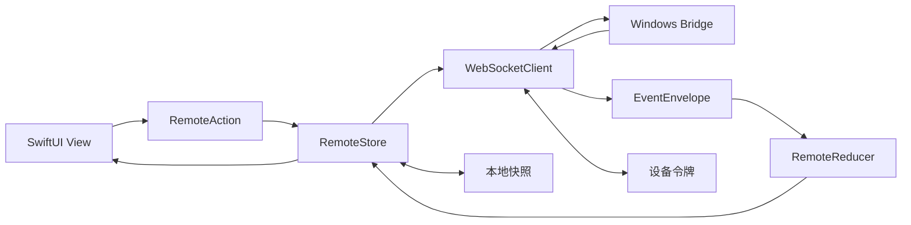

# Codex Remote 原生 iOS 迁移计划

## 1. 决策

正式 iPhone 客户端改用 SwiftUI 原生实现，不再采用 Capacitor、WKWebView 或把现有 React 页面嵌入 IPA 的方案。

现有 Web 端不删除，继续承担：

- Windows 桌面调试器。
- 协议模拟器可视化前端。
- Chromium/WebKit 自动化回归。
- Bridge 故障诊断和紧急降级访问。

原生端与 Web 端共享协议和行为契约，不共享 UI 代码。

## 2. 迁移目标

- 在 iPhone 14 Pro Max / iOS 16.3 上获得稳定的长历史滚动、流式输出和键盘体验。
- 直接使用 SwiftUI、Keychain、LocalAuthentication、PhotosUI、文件选择和 App 生命周期 API。
- 复用现有 Windows Bridge、Native Host、Cloudflare Tunnel、设备配对和协议模拟器。
- 保持 Desktop、Web 调试器和 iPhone 对同一线程、回合、审批和事件序号的一致理解。
- 通过 GitHub macOS Runner 编译、测试和生成 TrollStore IPA，不要求 Windows 本机安装 Xcode。

## 3. 不迁移的部分

以下模块继续沿用现有实现：

- Windows Native Host 与同一 `codex app-server` 接入。
- Windows Bridge、工作区白名单、设备鉴权和请求幂等。
- Cloudflare HTTPS/WSS 入口。
- 协议模拟器、故障注入和脱敏事件夹具。
- React Web 调试器及其浏览器回归。

第一版原生客户端不包含：

- App Store 发布和标准签名。
- APNs 完成通知。
- 后台无限保持 WebSocket。
- 在手机本地执行模型请求、命令或文件操作。
- 为了兼容旧 Web UI 而嵌入 WKWebView。

## 4. 目标目录

```text
apps/ios/
├── RemoteCodex/
│   ├── App/
│   │   ├── RemoteCodexApp.swift
│   │   ├── AppEnvironment.swift
│   │   └── RootView.swift
│   ├── Core/
│   │   ├── Protocol/
│   │   ├── Transport/
│   │   ├── State/
│   │   ├── Persistence/
│   │   ├── Security/
│   │   └── Diagnostics/
│   ├── Features/
│   │   ├── Pairing/
│   │   ├── Threads/
│   │   ├── Timeline/
│   │   ├── Composer/
│   │   ├── Workspaces/
│   │   ├── Approvals/
│   │   └── Settings/
│   ├── DesignSystem/
│   └── Resources/
├── RemoteCodexTests/
├── RemoteCodexUITests/
└── RemoteCodex.xcodeproj
```

协议新增规划目录：

```text
packages/protocol-schema/
├── remote-protocol.schema.json
├── fixtures/
├── generated/
│   └── RemoteProtocol.swift
└── scripts/
    └── verify-generated-models.mjs
```

## 5. 原生架构

### 5.1 数据流



约束：

- View 不直接发送 WebSocket 请求。
- Transport 不直接修改 SwiftUI 状态。
- 所有服务端事件必须经过同一个纯函数归约器。
- 请求响应状态与事件状态分开，服务端事件仍是线程事实来源。
- UI 只订阅当前页面需要的派生状态，避免单个 token 导致全应用刷新。

### 5.2 协议层

- `ClientRequestEnvelope`、`ServerResponseEnvelope` 和 `EventEnvelope` 使用 `Codable`。
- Swift 枚举需要保留未知事件和未知字段的向前兼容能力。
- 请求 ID、`clientRequestId`、事件序号和错误码与 TypeScript 定义完全一致。
- 协议 Schema 是跨语言事实来源，Swift 生成文件不手工编辑。
- CI 对同一夹具分别运行 TypeScript 和 Swift 归约器，并比较规范化状态快照。

### 5.3 连接层

`RemoteWebSocketClient` 负责：

- `URLSessionWebSocketTask` 建连与关闭。
- WebSocket 子协议中的设备令牌。
- 请求 ID 与异步 continuation 关联。
- 请求超时、连接关闭时批量失败和安全重试。
- `events.resume`、`events.ack`、心跳和事件序号恢复。
- Wi-Fi/蜂窝切换、前后台和网络路径变化后的指数退避重连。
- 相同消息沿用原 `clientRequestId`，避免重复生成回合。

### 5.4 状态层

`RemoteStore` 使用 `ObservableObject`，兼容 iOS 16.3，不依赖 iOS 17 Observation。

核心状态：

- 连接、配对与当前设备。
- 会话摘要、当前会话和分页游标。
- 回合、消息、推理、计划、工具、差异和审批。
- 当前提交、失败重试和离线保留状态。
- 自动跟随、未读数量和用户阅读位置。
- 工作区白名单、附件草稿和页面导航。

### 5.5 持久化与安全

- 设备令牌和私钥只写入 Keychain。
- UserDefaults 只保存非敏感偏好，例如主题、最后打开线程 ID 和显示设置。
- 当前会话快照写入 Application Support，使用原子替换并设置体积、回合数和保留时间上限。
- 附件正文、审批内容和设备令牌不进入长期会话快照。
- 日志默认脱敏，不记录消息正文、路径令牌、设备令牌或附件内容。
- Face ID 失败时不泄露会话预览；是否允许设备密码回退作为显式设置。

## 6. UI 模块计划

### 6.1 启动与配对

- Face ID 解锁。
- 已配对电脑列表和连接状态。
- 六位配对码输入；二维码扫描作为原生增强。
- 撤销、本机忘记设备和重新配对。
- 版本不兼容与 Bridge 离线使用明确错误页。

### 6.2 会话导航

- `NavigationStack` 管理主导航。
- iPhone 使用原生侧栏 Sheet 或抽屉式导航，不复制桌面 Web 布局。
- 会话按工作区分组，支持搜索、分页、刷新、运行中和未读状态。
- 新建会话只能选择 Bridge 返回的工作区白名单。

### 6.3 时间线

- 使用 `ScrollViewReader`、`ScrollView` 和 `LazyVStack`。
- 回合是一级窗口化单元，消息和工具项在回合内部按事件顺序渲染。
- 运行中过程展开，最终回复出现后自动折叠；用户手动展开状态在本会话内保持。
- 用户阅读旧消息时暂停自动跟随，并显示未读数量和“回到底部”。
- Markdown、代码和差异解析在后台执行，按内容哈希缓存。
- 大输出只保留可见块与首尾摘要，按需展开完整内容。

### 6.4 Composer

- 原生多行 `TextEditor`。
- 发送、停止和附件按钮保持 44 pt 以上触控区域。
- 图片使用 PhotosPicker，文件使用 fileImporter，音频使用系统文件或录音入口。
- 离线时保留草稿和附件，连接恢复后由用户确认提交。
- 发送后在 Bridge 确认前显示“提交中”，失败可安全重试并复用相同幂等 ID。

### 6.5 Markdown、代码和差异

- 普通 Markdown 使用原生文本分段布局，不把整个回复放入单个超大 `Text`。
- 代码块独立横向滚动，提供复制、语言标签和折叠。
- unified diff 解析为文件、hunk 和行模型，增删行按需渲染并显示旧/新行号。
- 超大代码或差异先显示摘要，用户展开后再加载详细行模型。
- 第一版优先正确性和滚动稳定性，语法高亮不得阻塞主线程。

## 7. 性能预算

最终指标以 iPhone 14 Pro Max / iOS 16.3 真机为准：

| 场景 | 目标 |
| --- | --- |
| 有本地快照冷启动 | 1.5 秒内出现可交互会话画面 |
| 500 回合 / 10,000 条目 | 可连续滚动，无持续卡顿 |
| 主线程阻塞 | 单次不超过 100 ms |
| 长历史常驻内存 | 目标不超过 250 MB |
| 流式刷新合并 | 30～50 ms 一批，不按 token 全量刷新 |
| 回到底部 | 300 ms 内完成定位 |
| 后台返回 | 先显示原画面，再增量恢复，不出现空白时间线 |

性能手段：

- 回合级窗口化和惰性视图。
- Markdown、差异和高亮后台解析。
- 值类型模型按线程分片，避免复制整个应用状态。
- 流式 delta 合并后再发布 UI 更新。
- 内容哈希缓存设置成本和容量上限。
- 离开会话时释放可再生成缓存。

## 8. 阶段交付

### 阶段 7：原生基础

交付：

- Xcode 工程和目录骨架。
- Swift 协议模型和夹具测试。
- WebSocket 客户端、EventStore、Reducer 和快照。
- Keychain、配对、会话列表、基础时间线和 Composer。
- macOS CI 的模拟器构建和单元测试。

出口条件：模拟器上可以连接协议模拟器，打开历史会话、发送消息并看到流式回复。

### 阶段 8：功能与性能对齐

交付：

- Markdown、代码、差异、附件、工作区、审批、停止、重试和未读。
- 弱网、前后台、版本保护和重复提交测试。
- XCTest、XCUITest、性能基线和 Web/Swift 状态一致性检查。
- GitHub macOS、Windows 和 Web 工作流。

出口条件：原生端覆盖阶段 6 功能矩阵，性能预算和全部 CI 通过。

### 阶段 9：IPA 与真机

交付：

- TrollStore 测试 IPA、SHA-256、构建清单和发布说明。
- 真机安装、升级、回滚、配对和 24 小时候选版测试记录。
- 正式 IPA 和可复现打包工作流。

出口条件：iPhone 14 Pro Max / iOS 16.3 长时间使用无明显卡顿、会话错位、重复提交或不可恢复断线。

## 9. 测试矩阵

| 层级 | 工具 | 覆盖内容 |
| --- | --- | --- |
| 协议 | XCTest + Vitest | Codable、未知字段、事件顺序、归约快照 |
| Transport | XCTest | 请求关联、超时、重连、回放、幂等 |
| Store | XCTest | 会话、回合、审批、未读、快照和错误状态 |
| UI | XCUITest | 列表、发送、停止、审批、附件、断线恢复 |
| 性能 | XCTest + Instruments | 启动、长历史、滚动、内存、Hangs、流式刷新 |
| Web 基线 | Vitest + Playwright | Bridge 与协议回归、降级入口 |
| 真机 | 人工清单 + Instruments | iOS 16.3、TrollStore、网络、后台、24 小时稳定性 |

## 10. 第一批实施任务

1. 新增 `packages/protocol-schema`，从当前 TypeScript 类型导出版本化协议 Schema 和夹具清单。
2. 新增 `apps/ios` Xcode 工程骨架，固定 iOS 16.3 和 SwiftUI 生命周期。
3. 生成第一版 `RemoteProtocol.swift`，为所有现有夹具增加 Swift 解码测试。
4. 实现 `RemoteWebSocketClient` 的建连、请求响应、超时、`events.resume` 和 `events.ack`。
5. 移植 `createInitialState`、`applyEvent`、`setActiveThread` 和展开状态归约逻辑。
6. 实现 Keychain 令牌仓库、配对页面和连接状态页。
7. 实现会话列表、工作区选择、基础时间线和 Composer。
8. 建立 macOS GitHub Actions：协议生成校验、模拟器构建和 XCTest。
9. 使用协议模拟器打通“列表 → 打开 → 发送 → 流式完成”的第一条原生纵向链路。
10. 记录首次 Instruments 基线，之后每个阶段比较启动、滚动和内存变化。

## 11. 完成定义

只有同时满足以下条件，原生迁移才算完成：

- IPA 中不嵌入 Web 业务 UI。
- 阶段 6 的功能矩阵全部由 SwiftUI 原生实现。
- Swift 与 TypeScript 协议夹具结果一致。
- 性能预算在目标真机通过。
- Bridge、Desktop 和 iPhone 同线程实时同步。
- TrollStore 安装、升级和回滚可重复。
- 24 小时候选版测试无阻断问题。
