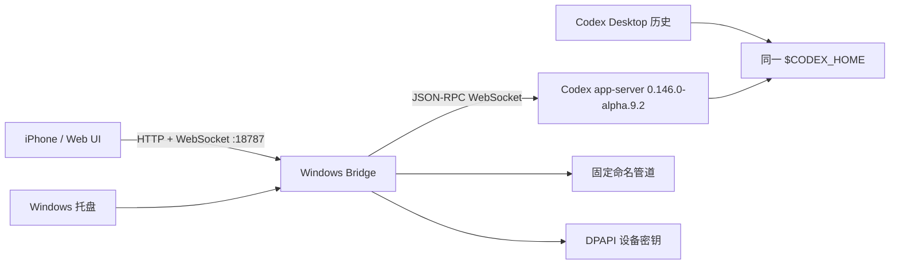

# 阶段 3：Windows Bridge 与真实 Codex 完成报告

完成日期：2026-08-02

## 运行结构



Bridge 只启动阶段 0 复制并校验过的 Desktop native 副本，不在 WindowsApps 内原地执行或修改文件，也不修改 Codex 配置。

## 已实现能力

- 自动发现 `CODEX_EXECUTABLE` 或阶段 0 的安全 native 副本。
- 启动环回 app-server、等待 `/readyz`、完成 `initialize`/`initialized` 协商。
- 精确版本门禁；当前只允许 `0.146.0-alpha.9.2`，不匹配默认拒绝启动。
- 将 `thread/list`、`thread/resume`、`thread/start`、`thread/delete`、`turn/start` 和 `turn/interrupt` 映射到同一个 app-server。
- 将 app-server 通知、增量和服务器审批请求规范化并广播给全部 Web 客户端。
- 事件日志容量 2,000，支持序号、客户端确认和断线重放。
- 固定实例发现管道 `\\.\pipe\codex-remote-tentel`，支持状态、配对、设备列表、撤销、打开 UI 和退出。
- HTTP 健康检查、生产 Web 静态服务和 WebSocket 服务共用端口 `18787`。
- 6 位一次性配对码、5 分钟失效、设备令牌、撤销后立即断开。
- 电脑设备密钥使用 Windows CurrentUser DPAPI 加密并原子保存。
- PowerShell 5 兼容托盘；源码保持 ASCII，运行时还原 UTF-8 中文菜单。

## 真实 app-server 端到端证据

验证命令：

```powershell
pnpm start:bridge
pnpm verify:real
```

实测 app-server：

- Desktop native：`0.146.0-alpha.9.2`。
- User-Agent：`Codex Desktop/0.146.0-alpha.9.2 ... (codex_remote_bridge; 0.1.0)`。
- Codex Home：`C:\Users\tentel\.codex`。
- 命名管道状态查询返回 Bridge `0.1.0` 和同一 app-server URL。

一次完整验收生成的证据：

- 临时线程：`019fbf2a-14b8-7fa0-b0b0-8ee00beae44f`。
- 首轮真实回复：`019fbf2a-151f-79a3-9d29-334a5ab5eae9`。
- 历史列表能找到该线程。
- 第二个 WebSocket 客户端恢复后包含首轮，并继续完成回合 `019fbf2a-40a7-72b0-8882-c95efa1a370b`。
- 无副作用的真实 `python -c` shell 审批被手机协议接受，回合为 `019fbf2a-6722-7873-a05f-a1acc3df7ea8`。
- 30 秒命令进入运行状态后成功中断，回合状态为 `interrupted`，ID 为 `019fbf2b-c1a8-7800-9d95-6f990fabb730`。
- 验收脚本最终删除临时线程；随后以 `REMOTE_CODEX_STAGE3` 搜索确认匹配数为 0。

其他实测：

- DPAPI 明文加密、解密往返成功，密文长度 246 字节。
- 独立测试 Bridge 完成配对、DPAPI 密文检查、令牌鉴权和设备撤销；撤销后的旧令牌收到 HTTP 401，正式设备列表未被污染。
- 错误期望版本 `0.0.0` 被启动门禁明确拒绝。
- 托盘脚本在 Windows PowerShell 5 下成功保持运行，验收后已终止测试托盘进程。
- 浏览器直接访问 `http://192.168.1.46:18787/`，显示电脑真实历史会话并报告“电脑在线”。

## 边界说明

当前 Codex Desktop 自身以 stdio 连接它的 app-server，无法让外部 Bridge 直接加入该 stdio 通道。阶段 3 因而使用同版本 native 和同一 `$CODEX_HOME` 管理真实 app-server，所有手机连接共享该实例。桌面 UI 与手机对“当前正在运行的同一回合”双向实时展示仍属于阶段 7 的 native 多路复用工作，不属于阶段 3。

阶段 3 验收结论：通过。
