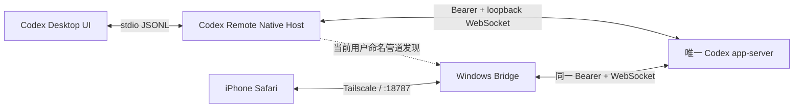

# 阶段 4：同实例 Native Host 设计记录

## 决策

将原计划阶段 7 的同实例接入提前并并入阶段 4。正常远程链路不再允许 Bridge 自行启动第二个 `codex app-server`。

采用外置 `.NET 8` Native Host，而不是修改 WindowsApps、ASAR 或 Codex Rust 原生文件：

1. Codex Desktop 已支持通过 `CODEX_CLI_PATH` 选择 CLI 可执行文件。
2. Native Host 接收 Desktop 原有的 `app-server` 参数，启动一个真实 Codex app-server WebSocket。
3. Native Host 自己连接该 WebSocket，并在 stdio 与 WebSocket 之间逐条转发 JSONL，使 Desktop UI 无需修改。
4. Windows Bridge 通过仅当前 Windows 用户可访问的命名管道发现同一 WebSocket，再作为第二个初始化客户端接入。
5. app-server 只监听 `127.0.0.1`，同时启用随机能力令牌；管道返回的令牌只在本次 Desktop 生命周期内有效。

## 精确兼容边界

当前实现只接受：

- Codex Desktop：`26.727.6591.0`
- Codex native：`0.146.0-alpha.9.2`
- 源码标签：`rust-v0.146.0-alpha.9.2`
- native SHA-256：`ECD7A3EAFF5E42723DBBA03B5C91514B3986B5DB5CBCA8F34619620B5356F31F`
- Native Host 发现协议：`1`

Native Host、Bridge 和阶段 4 启动脚本分别进行核对。任一字段不匹配时失败，不允许自动降级为独立 app-server。

## 上游源码依据

精确标签源码已经确认：

- WebSocket transport 会为每个连接分配独立 `ConnectionId`。
- app-server 同时维护多个连接和各自的初始化状态。
- 普通服务器通知会广播给所有已初始化连接。
- 服务器审批请求可广播到多个连接；第一个有效响应完成同一待处理请求。
- `stdio` 是单客户端模式，而 WebSocket transport 不会在某一个连接关闭时退出整个 app-server。

对应上游文件：

- `codex-rs/app-server/src/lib.rs`
- `codex-rs/app-server/src/transport.rs`
- `codex-rs/app-server/src/outgoing_message.rs`
- `codex-rs/app-server-transport/src/transport/websocket.rs`
- `codex-rs/app-server-transport/src/transport/auth.rs`

## 安装与回滚边界

- Windows EXE 默认使用本机 .NET 8 SDK 编译，产出自包含单文件 EXE 和 SHA-256；GitHub Windows runner 只作为可选 CI 复核。
- 安装脚本必须在 Codex Desktop 完全退出后由外部 PowerShell 执行。
- 安装只设置当前用户的 `CODEX_CLI_PATH` 与 `CODEX_REMOTE_REAL_CODEX_PATH`，不写 WindowsApps。
- 首次安装会保存原环境变量；重复安装会保留上一版 EXE 备份。
- 回滚脚本只恢复环境变量并保留文件，避免不可恢复删除。

## 本机编译与集成证据

- 本地 SDK：`.NET 8.0.423`；运行时：`8.0.29`。
- 当前 Windows x64 单文件产物 SHA-256：`CFEB0FFC02A7F27FD0B38F856624F580FD6CE7BE81D6F440A3B12C6EFC4CBE8A`。
- 已修复 Windows `Console.In` 包装器导致的伪异步阻塞，stdio 输入改为直接读取标准输入管道的异步 `StreamReader`。
- 集成测试已证明 Desktop stdio 和 Bridge WebSocket 使用同一 Host、同一 `codexPid`；Bridge 写入可恢复历史后，Desktop 成功恢复相同 `threadId`。
- 测试线程会在断言完成后删除，不调用模型。

## 阶段 4 必测结果

1. Desktop 主进程的直接 app-server 子进程是 `codex-remote-native-host.exe`。
2. Native Host 只启动一个哈希匹配的真实 `codex.exe app-server --listen ws://127.0.0.1:*`。
3. Bridge 状态显示 `appServerMode=native-host`，且其 `codexPid` 与 Native Host 发现结果一致。
4. iPhone 在当前 Desktop 已打开的会话发送唯一消息，Desktop 立即出现同一用户消息。
5. 两端同时显示同一回合的流式内容、工具状态、审批与完成状态。
6. 刷新手机页面、网络切换或重启 Bridge 不会创建第二个 app-server。
