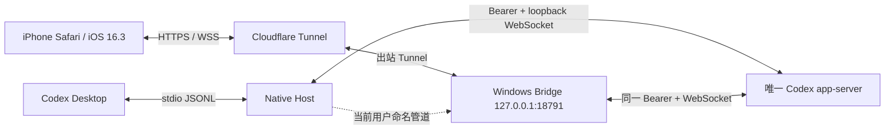

# 阶段 4：同实例 Native Host、Cloudflare Tunnel 与 iPhone Safari 联调

## 当前状态

阶段 4 进行中。同实例 Native Host 已完成本机编译、安装和真实双客户端验证；默认远程传输已从 Tailscale 切换为 Cloudflare Tunnel，固定入口为 `https://codex-remote.bltbbbego.store/`，手机不再需要开启 VPN。Tailscale 入口暂时保留为诊断回退。

## 目标

- Windows 与 iPhone 不在同一局域网时，仍能安全访问 Codex Remote。
- 不开放路由器端口，不把 Bridge 直接暴露到公网。
- iPhone Safari 能通过 Bridge app-server 完成历史列表、新建、继续、实时输出、停止、审批和配对。
- 手机与 Desktop 必须连接同一个 app-server；两端能同时看到同一用户消息、回合、工具、审批和完成事件。
- Wi-Fi、蜂窝网络、网络切换、短时后台和恢复时不重复提交、不丢失已确认事件。
- 适配 iPhone 14 Pro Max 的 430×932 pt 画布、灵动岛安全区域、软键盘和触控。

## 传输方案

阶段 4 默认使用 Cloudflare Tunnel：



Cloudflare Tunnel 负责无需手机 VPN 的公网传输。Bridge 仍使用自己的设备配对、撤销、来源校验和事件序号恢复。Cloudflare 会终止 TLS；若未来要求 Cloudflare 也无法读取内容，再增加应用层端到端加密。

正常阶段 4 链路禁止 Bridge 启动独立 app-server。Native Host 使用 Desktop 已支持的 `CODEX_CLI_PATH` 入口，把 Desktop 的 stdio JSONL 适配到受能力令牌保护的回环 WebSocket；Bridge 再通过当前用户命名管道加入同一个 app-server。未发现 Host、版本不匹配或哈希不匹配时直接失败，不允许静默回退。

## 电脑端准备

1. 在电脑安装并登录 `cloudflared`；手机不需要安装客户端。
2. 在本机准备 .NET 8 SDK、编译 Native Host 并运行同实例集成验证：

```powershell
pnpm install:dotnet-sdk
pnpm build:native-host
pnpm verify:native-host
```

4. 启动外部安装助手。它会打开独立 Windows PowerShell 5 窗口，只等待用户主动完全退出 Codex，安装完成后自动重新打开应用：

```powershell
pnpm install:native-host:external
```

5. Codex Desktop 重新启动后，构建并启动 Cloudflare 入口：

```powershell
pnpm build
pnpm setup:cloudflare
pnpm launch:cloudflare
pnpm verify:cloudflare
```

6. 构建共享 Web UI：

```powershell
pnpm build
```

7. 如果 Windows 防火墙阻止连接，在管理员 PowerShell 运行：

```powershell
powershell -NoProfile -ExecutionPolicy Bypass -File .\scripts\configure-stage4-firewall.ps1
```

8. 默认公开地址：

```powershell
https://codex-remote.bltbbbego.store/
```

启动脚本会：

- 确认 `codex-remote` Tunnel、凭据和固定 DNS 记录。
- 通过 `\\.\pipe\codex-remote-native-v1` 确认 Desktop Native Host、真实 Codex PID、版本、源码标签和 SHA-256。
- Bridge 只附加 Host 返回的同一 app-server，不创建第二个原生进程。
- 将 `CODEX_REMOTE_HOST` 固定为 `127.0.0.1`，端口为 `18791`。
- 将 `CODEX_REMOTE_AUTH_MODE` 强制设为 `required`。
- 启用电脑托盘菜单。
- 托盘打开公网 HTTPS 地址，但生成配对码和退出始终走本机回环。

## 手机配对

1. iPhone 无需开启 Tailscale 或其他 VPN。
2. Safari 打开 `https://codex-remote.bltbbbego.store/`。
4. 电脑托盘选择“生成手机配对码”。
5. 手机点击“配对”，输入 6 位配对码和设备名称。
6. 页面显示“电脑在线”后，打开已有会话并发送一条测试消息。

## 安全边界

- 禁止路由器端口映射和公网 DDNS 直连 `18787`。
- Bridge 只监听 `127.0.0.1:18791`，公网没有直接入站端口。
- 只有来自本机回环 `cloudflared` 的转发头受信任；带远端客户端地址的请求不能调用本机管理接口。
- WebSocket 和配对请求检查浏览器 `Origin`，默认只允许同源页面及本机开发端口。
- 配对失败按来源 IP 限制为 5 分钟最多 8 次。
- 外网调试从首次启动起强制设备令牌，不允许匿名 WebSocket。
- HTTPS/WSS 使用 WebSocket 子协议承载设备令牌，不把令牌放入公网 URL。

## 自动化验证矩阵

| 用例 | 自动化方式 | 状态 |
| --- | --- | --- |
| 430×932 视口无横向溢出 | Playwright Mobile WebKit | 通过 |
| 输入框字号不触发 iOS 自动缩放 | 计算样式断言不小于 16px | 通过 |
| Visual Viewport 改变后页面高度同步 | Mobile WebKit 视口断言 | 通过 |
| 网络离线时明确显示状态 | Playwright 离线模式 | 通过 |
| 网络恢复后自动重连 | Playwright 离线/在线切换 | 通过 |
| 恢复后重新打开当前会话 | 本地保存活动线程并重新读取 | 通过 |
| 非同源 WebSocket/配对来源拒绝 | Windows Bridge 单元测试 | 通过 |
| Native Host 回环地址与能力令牌解析 | Windows Bridge 单元测试 | 通过 |
| Native Host Windows x64 单文件 EXE | 本机 .NET 8 发布与 SHA-256 | 通过 |
| Desktop 与 Bridge 共享同一 app-server | 双客户端集成测试、同一 `codexPid`、同线程恢复 | 通过 |
| Desktop 与真实 iPhone 共享同一 app-server | PID、管道状态与唯一消息真机断言 | 通过 |
| Tailscale 地址只监听与强制鉴权 | 启动脚本检查 | 通过 |
| 历史首屏和当前会话预热 | Bridge 缓存单元测试与真实链路计时 | 通过 |
| 英文内部摘要转中文、总耗时与加载骨架 | Web 组件测试 | 通过 |
| 超长无空格消息不产生横向滚动 | iPhone 14 Pro Max Mobile WebKit | 通过 |
| 页面进程回收后不闪骨架且立即恢复当前会话 | Mobile WebKit 整页重载与标签页快照断言 | 通过 |
| 顶部、会话区和输入框保留稳定右侧距离 | 414px 可视视口与 32px 最小间距断言 | 通过 |
| 新建会话后立即发送并出现在侧栏 | Mobile WebKit 新建与活动线程断言 | 通过 |
| 停止正在运行的回合且不继续生成最终回复 | Mobile WebKit 中断状态与消息断言 | 通过 |
| 拒绝审批后清除弹窗并明确标记失败 | Mobile WebKit 审批拒绝与失败状态断言 | 通过 |
| 新建默认审批策略、停止参数及审批回写格式 | Windows Bridge 单元测试 | 通过 |
| 真实同实例新建、历史恢复、继续、允许/拒绝审批和停止 | 临时本机 Bridge 附加当前 Native Host 的 `verify:real` | 通过 |
| Cloudflare HTTPS、WSS、配对和远程管理隔离 | `verify:cloudflare` 真实公网验证 | 通过 |

## 本机验证结果

- `pnpm typecheck`：通过。
- `pnpm test`：4 个工作区、35 个单元测试全部通过。
- 本地 .NET SDK：`8.0.423`，运行时 `8.0.29`；由官方 ZIP 和 SHA-512 校验后安装在 `work/dotnet-sdk/8.0.423/`。
- `pnpm build:native-host`：自包含 Windows x64 单文件 EXE 编译通过；当前 SHA-256 为 `CFEB0FFC02A7F27FD0B38F856624F580FD6CE7BE81D6F440A3B12C6EFC4CBE8A`。
- `pnpm verify:native-host`：Desktop stdio 客户端与 Bridge WebSocket 客户端连接同一 `codexPid`，Bridge 创建并写入测试历史后 Desktop 成功恢复同一线程，测试线程随后删除。
- `pnpm verify:real`：使用临时 `127.0.0.1:18788` Bridge 附加当前 Desktop Native Host，确认 `appServerMode: native-host`、Native Host PID `73972`、Codex PID `24156` 和 app-server `ws://127.0.0.1:64967`。真实链路完成新建线程、历史列表发现、第二客户端恢复、继续发送、命令审批允许、命令审批拒绝且无命令输出，以及 30 秒任务中断；测试线程和临时 Bridge 随后清理，生产 `100.67.122.52:18787` Bridge 保持健康。
- Native Host 已安装到 `%LOCALAPPDATA%\CodexRemote\native-host\codex-remote-native-host.exe`，Desktop 重启后 Bridge 状态为 `appServerMode: native-host`。
- 真机唯一消息 `NATIVE_HOST_PHONE_OK_20260802` 已从 iPhone 进入 Desktop 当前会话，Desktop 回复也已在手机显示；旧的独立 app-server 分叉已消除。
- 真实链路基线计时为：WebSocket 连接约 `259ms`、事件恢复约 `11ms`、100 条历史列表约 `4030ms`、当前会话读取约 `189ms`。主要等待来自首次 `thread.list`。加入 Bridge 启动预热、增量缓存和并发去重后，重启复测为：连接 `253ms`、事件恢复 `41ms`、100 条历史列表 `1ms`、当前会话读取 `247ms`。Web 端另保存不含消息和凭据的会话摘要，刷新时先即时展示再后台同步。
- 手机端增加“同步历史”“载入会话”状态、历史和消息骨架屏、回合累计时间、英文内部摘要中文化、固定尺寸 SVG 操作图标以及全链路横向溢出约束。执行时间线进一步按 `commentary` 与 `final_answer` 分流：最终回复前平铺全部过程，第一段最终回复出现后立即折叠过程，只让最终回复继续增长。
- iOS 进入后台后暂停 JavaScript 与 WebSocket 属于系统行为，无法由网页持续保活。恢复策略现改为：后台超过 5 秒返回时快速重建 WebSocket，通过事件序号补放遗漏内容，同时保留当前会话 DOM；普通恢复不显示骨架、不调用 `thread.read`。Safari 回收整个页面进程时，页面先从当前标签页的临时快照恢复最多 12 个回合，再后台执行完整校准，因此旧内容不会被骨架替换。
- `thread.read` 只用于首次加载或尚未读取过的会话，等待上限由 30 秒延长到 120 秒；超过上限时提示电脑仍在后台加载，并继续接受 Bridge 随后发布的会话快照，不再把普通后台恢复误报为请求超时。
- iPhone 页面宽度继续跟随 `visualViewport`，顶部状态、会话时间线和底部输入区另外统一保留 34px 右侧保护距离，用于抵消 Safari 后台恢复后可见边界与布局边界的偏差。
- `pnpm build`：Web、协议、模拟器和 Windows Bridge 全部构建成功。
- `pnpm test:e2e`：Chromium、桌面 WebKit、Mobile WebKit 共 12 个用例通过，包括配对状态恢复、慢回复自动跟随、414px 窄可视视口、Safari 后台恢复、新建会话、停止任务和审批拒绝。整套串行回归中的原有字号读取曾因 WebKit 偶发延迟超时，单项复跑及完整 8 项 Mobile WebKit 复跑均通过，并已将该计算样式断言的等待上限调整为 15 秒。
- `pnpm verify:stage4`：真实 Bridge 健康检查、安全响应头、强制鉴权、跨站 WebSocket 拒绝、本机配对入口和 8 次失败后的配对限速全部通过。
- `pnpm verify:cloudflare`：`https://codex-remote.bltbbbego.store/` 的 HTTPS、WSS、一次性配对、子协议令牌和公网本机管理拒绝全部通过；连接信息确认仍是 Native Host PID `73972`、Codex PID `24156`、app-server `ws://127.0.0.1:64967`。
- 最新 Cloudflare 真机验收：用户从 iPhone Safari 向电脑当前 Codex 会话发送“手机发送信息测试”，该消息已在本桌面会话中到达，证明当前公网入口仍连接同一个 Native Host/app-server。
- 针对长会话新增首屏保护：首次事件恢复只重放轻量状态，完整会话正文通过异步 `thread.snapshot` 发送；`thread.read` 立即返回排队确认，不再重复传输约 2 MB 的会话正文。公网实测历史列表约 `1.6s` 返回，长会话快照约 `7s` 后到达且不触发请求超时。
- Cloudflare Bridge 后台只监听 `127.0.0.1:18791`；Tunnel `ae3d0a2a-180a-42ca-a53b-2c4ac0f708f8` 当前在线。`cloudflared 2025.8.1` 有升级提示，但本机还有其他运行中的 Tunnel，本阶段不进行全局升级。
- Tailscale Windows 1.98.10：已通过官方 winget 包安装并完成登录。
- Windows Tailscale IPv4：`100.67.122.52`；Bridge 实际只监听 `100.67.122.52:18787`。
- iPhone Tailscale IPv4：`100.114.115.29`，在线且处于活动状态。
- Windows 防火墙规则 `Codex Remote - Tailscale`：只允许远端 `100.64.0.0/10` 访问本机 Tailscale 地址的 TCP `18787`。
- iPhone 已完成配对，DPAPI 设备存储中存在未撤销的 `iPhone 14 Pro Max` 记录，配对后的 `lastSeenAt` 已再次更新。
- Windows 已观察到来自 `100.114.115.29` 到 `100.67.122.52:18787` 的已建立连接，证明手机令牌鉴权与外网传输已经实际连通。
- 第一条蜂窝网络测试消息已经由旧的独立 Bridge app-server 写入目标线程 rollout，并生成 `STAGE4_IPHONE_OK`，但没有进入 Desktop 当前内存视图。这个结果只证明外网、配对和独立 app-server 请求成功，不能作为“远程控制当前 Desktop 会话”的验收证据。旧 Bridge 已关闭，后续只接受同实例测试结果。
- 初次真机测试还发现手机长历史页面未持续跟随最新回复，以及连接过程错误显示“配对”按钮；已修复为持久显示“已配对”，并在刷新恢复、打开会话和流式输出期间自动滚动到最新内容，同实例链路复测已通过。
- 精确源码标签已确认 WebSocket transport 支持多个独立连接、按连接初始化和向所有已初始化连接广播通知；设计证据见 `docs/stage-4-native-host.md`。

## 真机验收清单

- [x] 蜂窝网络下打开历史列表。
- [x] 打开历史会话继续发送消息。
- [x] 手机发送消息后，Desktop 当前已打开的会话立即出现同一用户消息。
- [x] Desktop 当前会话的回复和过程事件返回手机。
- [ ] 两端同时看到同一审批；任一端处理后回合继续且不会重复执行。
- [ ] 新建会话并确认手机刷新后仍能重新打开。
- [ ] 流式推理和工具过程正常显示。
- [ ] 回合完成后过程自动折叠。
- [ ] 停止正在运行的回合。
- [ ] 批准和拒绝审批请求。
- [ ] Wi-Fi 切蜂窝后自动恢复。
- [ ] 蜂窝切 Wi-Fi 后自动恢复。
- [ ] 切后台 30 秒后返回并补齐事件。
- [ ] 锁屏后返回不重复提交消息。
- [ ] 软键盘弹出时输入框和最后一条消息仍可见。
- [ ] 长历史滚动无横向溢出和明显跳动。

## 完成条件

本机 Native Host 产物通过校验、外部安装可回滚、重启后的 Bridge 状态证明两端使用同一 `codexPid`，并且上面的真实 iPhone 清单全部确认后，阶段 4 才能从“进行中”改为“已完成”。本阶段不建立 Capacitor 工程，也不生成 IPA；GitHub Windows 构建仅作为可选 CI 复核。
